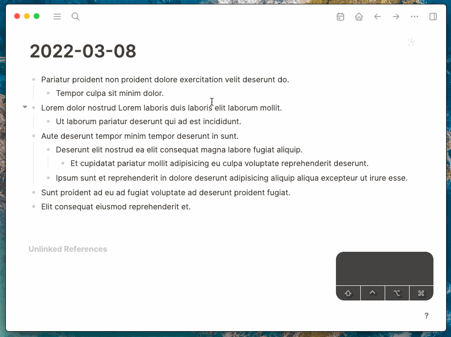

# Logseq VIM Editor

A VIM-like block editor for Logseq, if you are familiar with VIM, it will bring VIM level performance boost when you editing.

## Features

- Single block mode
- Multiple blocks mode
- Many VIM operations supported.

## Usage

The default trigger shortcut is `mod+shift+e`

## Multiple blocks mode notes

1. The order will be the selection order
2. All hierarchical blocks will be flattened.
3. Should not change the blockid, or the plugin can not locate block then the modification of that block will be lost.
4. What is the dots? It's zero width chars to verify block id, so also should not change those dots.

## Codemirror

The editor is based on [codemirror](https://codemirror.net/) v5, you can learn more from there. This plugin does not need to be a professional editor or IDE for editing Logseq blocks, you can just think it as a another way to editing blocks for fun.

## Buy me a coffee

If my plugin solve your situation a little bit and you will, you can choose to [buy me a coffee](https://www.buymeacoffee.com/vipzhicheng).

## Licence

MIT
